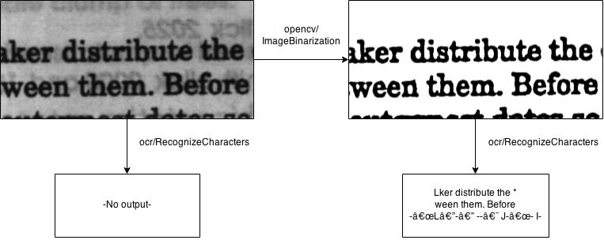

# Optical Character Recognition

Our OCR algorithm uses [Tesseract]() and its latest trained models. Tesseract is an open source OCR library that is currently being developed by Google. This algorithm uses the [model](https://drive.google.com/folderview?id=0B7l10Bj_LprhQnpSRkpGMGV2eE0&usp=sharing) trained on English character set. You are welcome to take this algorithm as an example and use other models. The algorithm makes use of [OpenCV’s image converter]() since Tesseract handles the tiff format. Please be aware that if you feed the algorithm an image in any format other than tiff, the algorithm will call the image converter and write the output to your collection, then operate on the converted image. 
      
There is an [image binarization algorithm]() on Algorithmia that cleans the noise in a given image. If the image you are trying to extract the text from is noisy, you may want to use that algorithm first.

The first input to the algorithm is the link to the media file (either a Data url that contains a sound file or a Youtube video url) and the second input to the algorithm is the collection where the extracted text should be written to (a Data collection url). We can only process the Youtube videos that are licensed under the Creative Commons license due to the prohibitive nature of the Standard Youtube License. The algorithm runs the raw Youtube video found in the link through a pipeline of downloading it, extracting the sound, converting the sound file to the correct format and then performing SR on it. If instead of a Youtube link, a link to a file in a Data collection is given; the algorithm treats it as a sound file and just converts it to the correct format before performing SR. If you would like to upload a video file, you can preprocess it with the sound extraction algorithm given in the link above. Sample image taken from Adaptive document image binarization, J. Sauvola, M. Pietikainen, Pattern Recognition 22 (200) 225-236